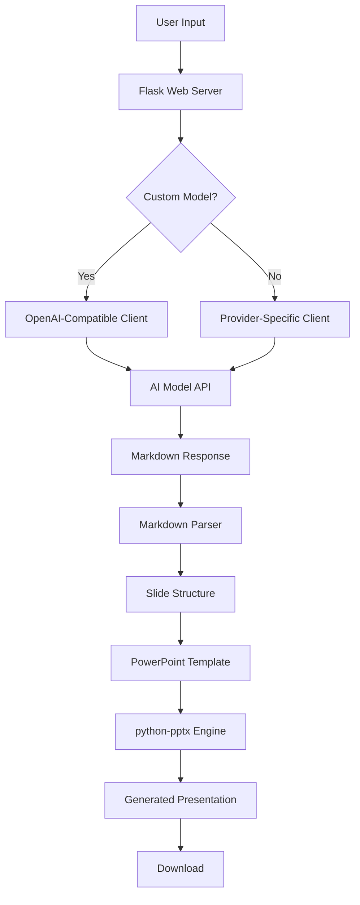

# SlideGen AI - PowerPoint Generator

[](https://www.python.org/)
[](https://palletsprojects.com/p/flask/)
[](LICENSE)

SlideGen AI transforms text content into professionally formatted PowerPoint presentations using AI. It preserves your template's visual identity while leveraging advanced natural language processing to structure content effectively.

## Features

- **Multi-Provider AI Support**: Works with Gemini, OpenAI, Claude, and custom OpenAI-compatible endpoints
- **Template Preservation**: Maintains all visual styling, assets, and layouts from your PowerPoint templates
- **Intelligent Content Structuring**: Automatically organizes content into appropriate slide layouts
- **Rich Text Formatting**: Preserves bold formatting and hierarchical bullet points
- **Responsive Web Interface**: Clean, dark-mode compatible UI with drag-and-drop file upload

## System Architecture



The system follows a modular architecture where the Flask backend orchestrates interactions between AI models and the python-pptx library.

## Technical Implementation

### Content Processing Pipeline

1. **Content Analysis and Structuring**
   The input text is processed by the selected AI model through a specialized system prompt that instructs the LLM to:
   - Parse natural language content into structured slide components
   - Identify logical sections and content hierarchy
   - Map content to appropriate slide layouts
   - Generate properly formatted Markdown with layout annotations

2. **Layout Intelligence**
   The application dynamically analyzes the uploaded PowerPoint template to:
   - Enumerate all available slide layouts and their names
   - Determine layout constraints (title capacity, body content capacity)
   - Identify placeholder types (title, body, content) for each layout
   - Create a layout mapping system that can match semantic layout names to actual template layouts

3. **Markdown-to-Slides Transformation**
   The generated Markdown is parsed by a custom parser that:
   - Extracts layout directives from HTML comments
   - Separates slide titles from content
   - Preserves bullet point hierarchy through indentation tracking
   - Maps slides to appropriate layouts using intelligent fallback mechanisms

4. **Formatting Preservation**
   The system maintains rich text formatting through:
   - Bold text extraction using regex pattern matching
   - Paragraph level management for proper indentation
   - Font size standardization (18pt for body text)
   - Markdown-like syntax processing for emphasis

### Template Style Preservation

The application preserves template integrity through several mechanisms:

**Layout Fidelity**
- Removes all original slides while maintaining master layouts
- Uses existing slide layouts without modification
- Respects placeholder constraints and positioning
- Maintains slide dimensions and orientation

**Visual Consistency**
- Master slide retention for consistent styling
- Color scheme preservation through template inheritance
- Typography settings maintained via layout placeholders
- Background graphics and assets untouched during content replacement

### API Integration

The system supports multiple AI providers through a unified OpenAI-compatible interface:
- **Gemini** (Google AI) - Base URL: `https://generativelanguage.googleapis.com/v1beta/`
- **OpenAI** (GPT models) - Base URL: `https://api.openai.com/v1/`
- **Claude** (Anthropic) - Base URL: `https://api.anthropic.com/v1/`
- **Custom Endpoints** - User-provided OpenAI-compatible APIs

Each provider is configured with appropriate base URLs and model mappings, with dynamic client initialization based on user selection.

## Setup Instructions

### Prerequisites
- Python 3.8 or higher
- pip package manager
- Virtual environment (recommended)

### Local Installation

1. **Clone the Repository**
   ```bash
   git clone https://github.com/23f3004008/TDS-EXTRA_PPT.git
   cd TDS-EXTRA_PPT
   ```

2. **Create Virtual Environment (Recommended)**
   ```bash
   python -m venv venv
   source venv/bin/activate  # On Windows: venv\Scripts\activate
   ```

3. **Install Dependencies**
   ```bash
   pip install -r requirements.txt
   ```

4. **Run the Application**
   ```bash
   python app.py
   ```

5. **Access the Web Interface**
   Open your browser and navigate to `http://localhost:5000`

## Deployment Options

### Docker Deployment

This application includes a Dockerfile for containerized deployment:

1. **Build the Docker Image**
   ```bash
   docker build -t slidegen-ai .
   ```

2. **Run the Container**
   ```bash
   docker run -p 8080:8080 slidegen-ai
   ```

3. **Access the Application**
   Open your browser and navigate to `http://localhost:8080`

The Docker image uses Python 3.11-slim as the base image and includes all necessary system dependencies for the Pillow library. The application runs with Gunicorn for production deployment.

### Render Deployment

To deploy on Render:

1. **Fork the Repository**
   Fork this repository to your GitHub account.

2. **Create a New Web Service on Render**
   - Go to [render.com](https://render.com/) and sign up or log in
   - Click "New" and select "Web Service"
   - Connect your GitHub account and select your forked repository

3. **Configure the Service**
   - Name: Choose a name for your service
   - Region: Select the region closest to your users
   - Branch: main (or your preferred branch)
   - Runtime: Python 3
   - Build Command: `pip install -r requirements.txt`
   - Start Command: `gunicorn -b 0.0.0.0:10000 app:app`
   - Plan: Choose your preferred plan (Free tier available)

4. **Set Environment Variables**
   - Add any required environment variables in the Dashboard > Environment section

5. **Deploy**
   Click "Create Web Service" and wait for the build to complete.

6. **Update Environment Variables (if needed)**
   After deployment, you may need to set the `PYTHON_VERSION` environment variable to `3.11` in the Render dashboard.

### Environment Variables

The application uses the following environment variables (all optional):

- `FLASK_ENV` - Set to `development` for debug mode
- API keys for various providers (not required as they're provided by the user in the UI)

## Usage Instructions

1. **Upload Template**: Upload a PowerPoint (.pptx) template file that will define the visual style of your presentation
2. **Select AI Provider**: Choose from Gemini, OpenAI, Claude, or use a custom OpenAI-compatible model
3. **Enter API Key**: Provide your API key for the selected provider (not stored)
4. **Input Content**: Describe your presentation content in detail, including key points, topics, and specific information
5. **Generate Presentation**: Click "Generate Presentation" to create your slides

For custom models:
1. Check the "Use custom OpenAI-compatible model" option
2. Enter the base API URL (must start with http:// or https://)
3. Enter the model name exactly as defined by your provider
4. Provide the appropriate API key for that endpoint

## Project Structure

```
TDS-EXTRA_PPT/
├── app.py                 # Main Flask application
├── requirements.txt       # Python dependencies
├── Dockerfile             # Docker configuration
├── .dockerignore          # Files to exclude from Docker builds
├── .env                   # Environment variables (optional)
├── .gitignore             # Git ignore patterns
├── README.md              # This file
├── templates/
│   └── index.html         # Web interface template
└── uploads/               # Temporary file storage (local only)
```

## Dependencies

Key dependencies include:
- **Flask**: Web framework for the user interface
- **python-pptx**: Library for creating and updating PowerPoint files
- **openai**: Official OpenAI Python library for API interactions
- **python-dotenv**: Environment variable management
- **Tailwind CSS**: Frontend styling (CDN loaded)
- **gunicorn**: WSGI server for production deployment

## Contributing

Contributions are welcome! Please feel free to submit a Pull Request.

1. Fork the repository
2. Create your feature branch (`git checkout -b feature/AmazingFeature`)
3. Commit your changes (`git commit -m 'Add some AmazingFeature'`)
4. Push to the branch (`git push origin feature/AmazingFeature`)
5. Open a Pull Request

## License

This project is licensed under the MIT License - see the [LICENSE](LICENSE) file for details.

